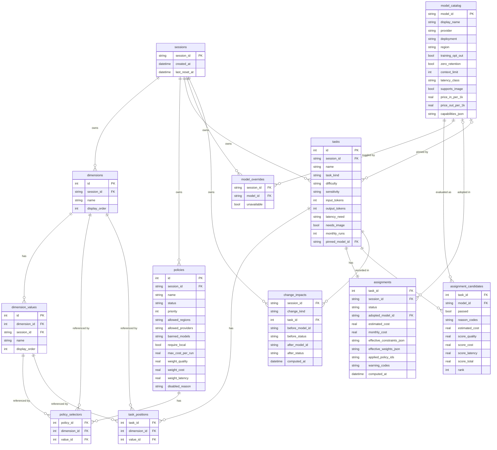
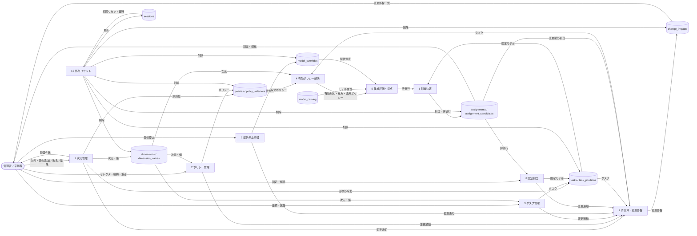
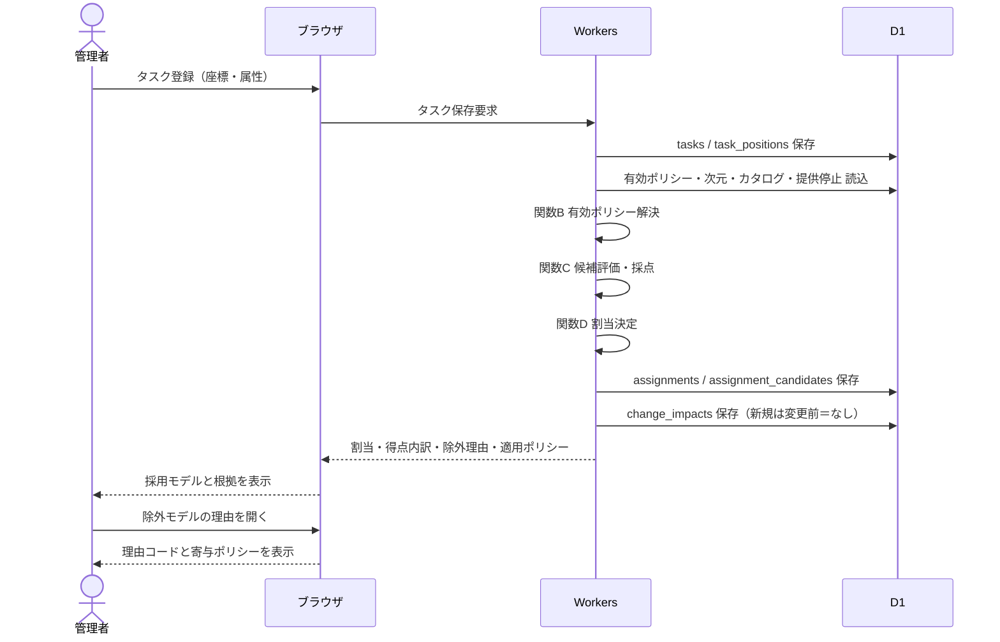
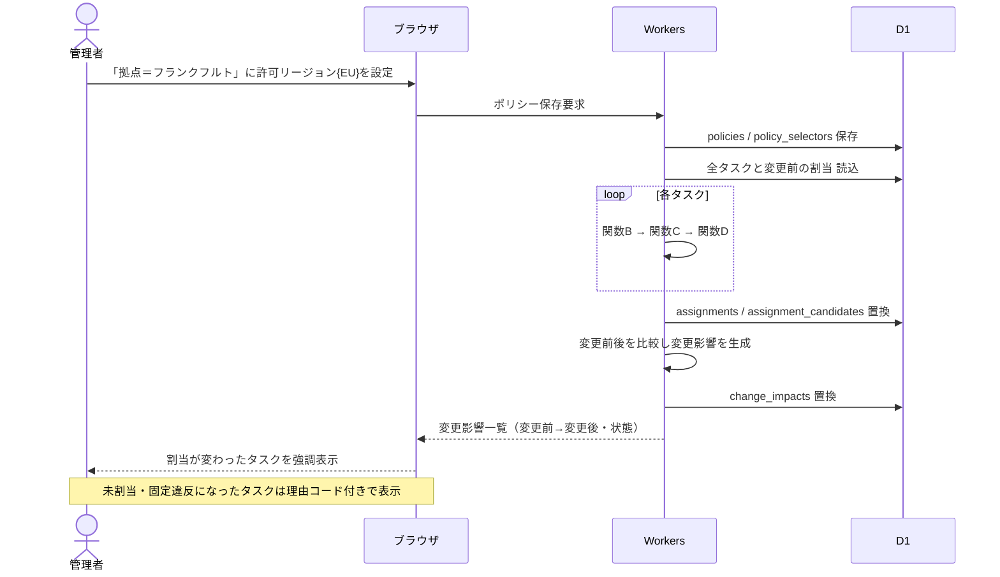
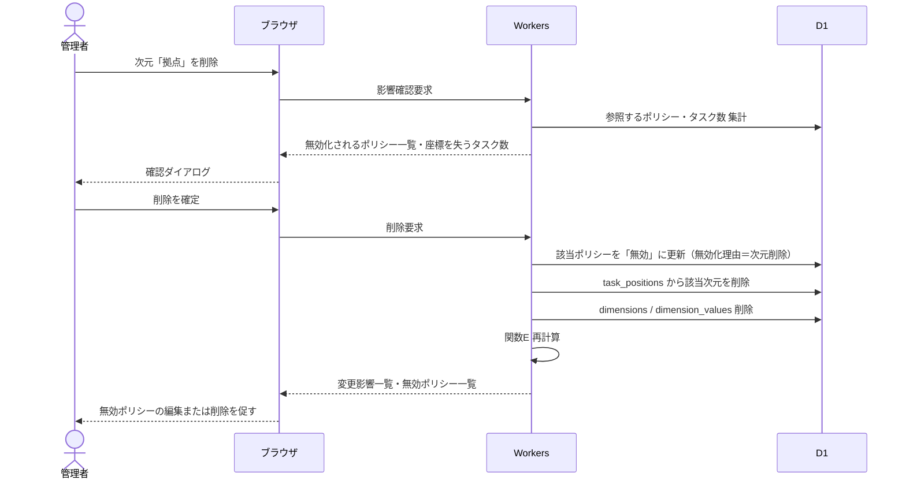
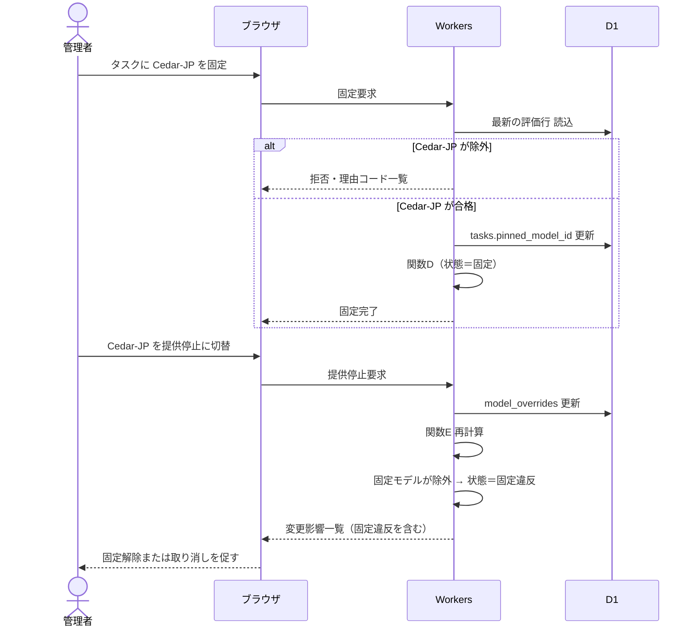
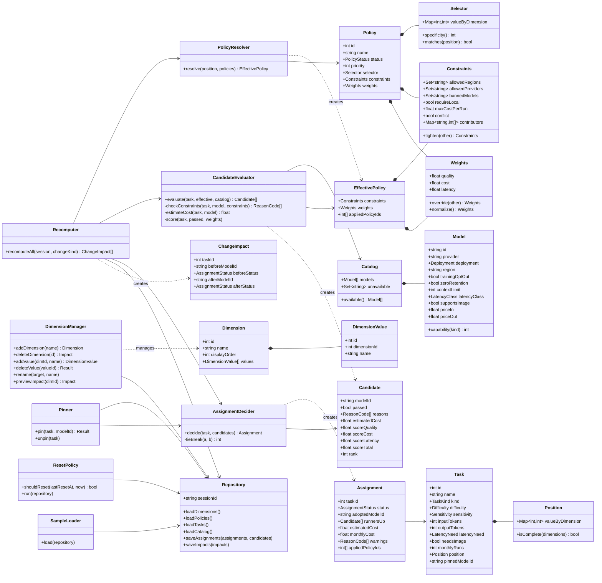
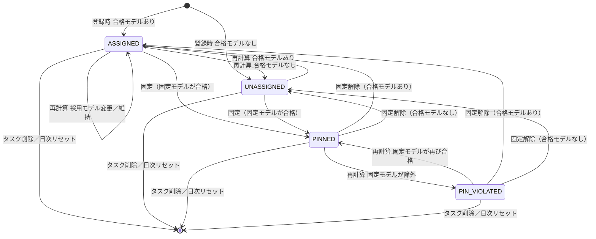
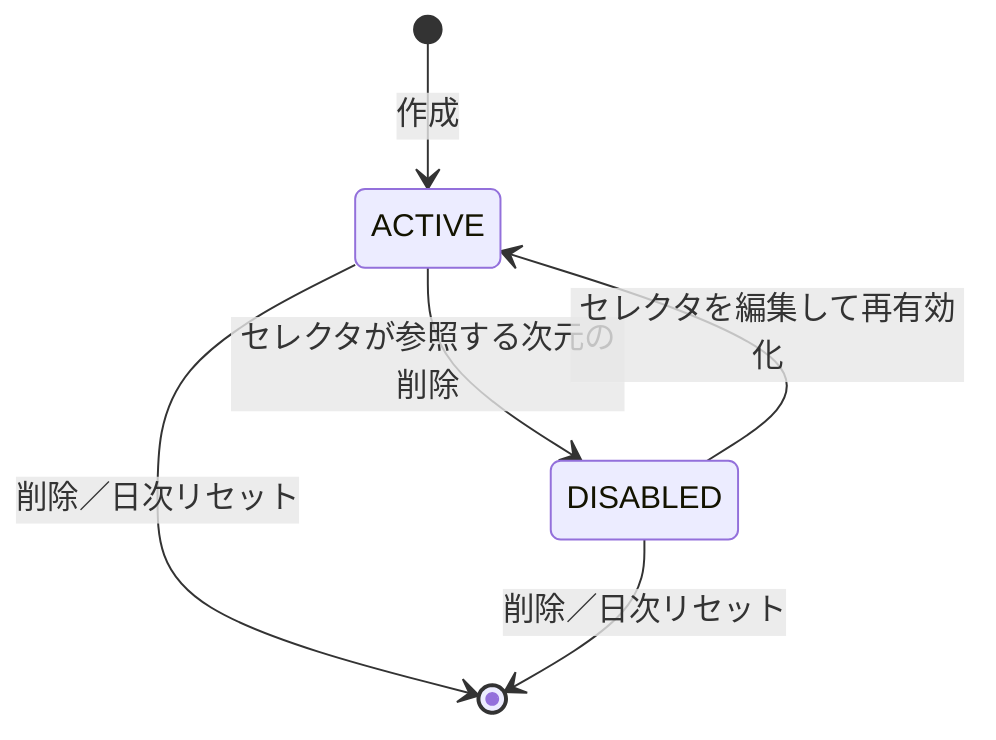
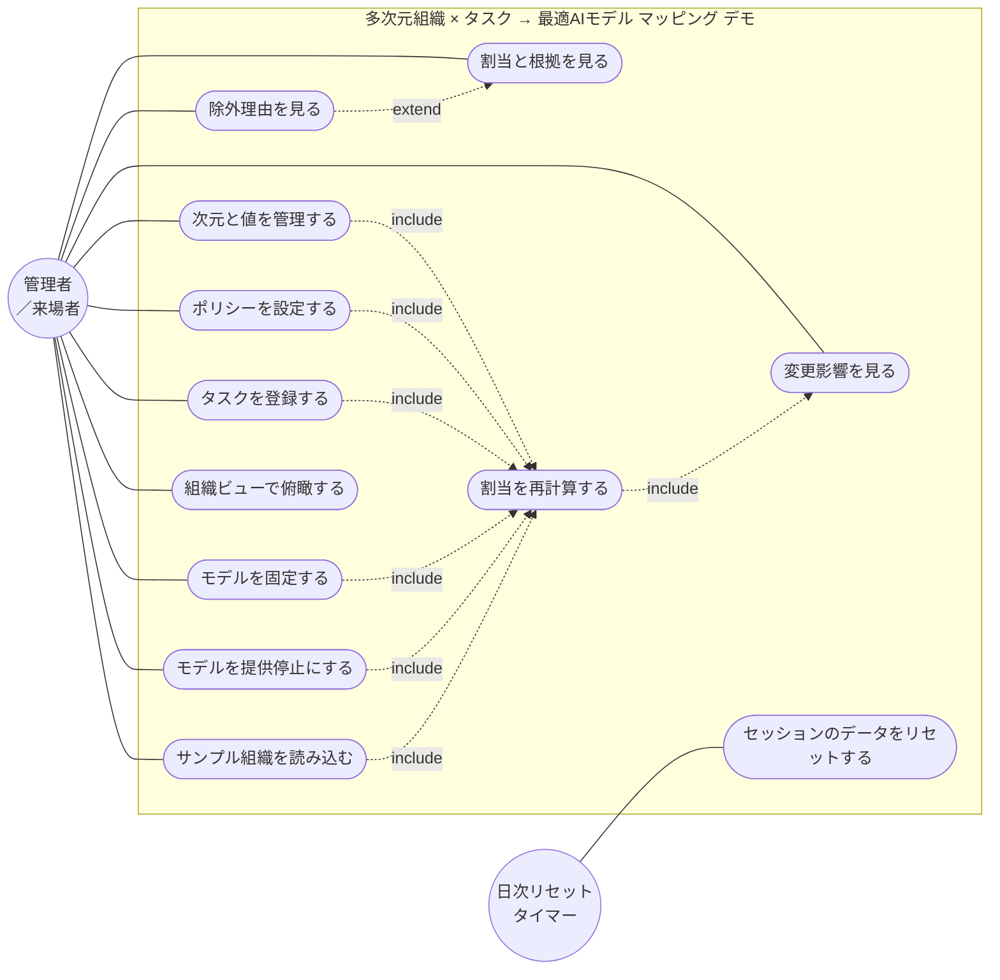

# 多次元組織テーブル × タスク → 最適AIモデル マッピング — デモ版 設計書

- リポジトリ名：`org-cube-model-router-demo`
- 対象エディション：デモ版（アイデアの視覚化）
- プラットフォーム：ウェブ（デモ版簡略構成：Cloudflare Workers/Pages + D1、SQLite互換）

---

## 1. 概要

### 1.1 課題

組織は部門・拠点・職種・プロジェクトなど複数の軸で構成され、その軸の数や値は組織ごと・時期ごとに変わる。AIモデルの利用方針（データの所在地、学習利用の可否、コスト上限、品質重視かコスト重視か）は、この軸の任意の組み合わせ（「フランクフルト拠点の全員」「人事部門の管理職」など）に対して定められる。一方、各タスクには機密度・難易度・入力量・応答速度の要求があり、モデルごとに能力・コスト・所在地・データ取り扱いが異なる。

この「可変の多次元組織テーブル」と「タスク属性」と「モデルカタログ」を突き合わせ、タスクごとに方針を満たしつつ最も適したモデルを決定し、**なぜそのモデルが選ばれ、他のモデルがなぜ除外されたか**を説明できる仕組みが必要である。

### 1.2 デモ版の到達点

来場者が「組織の次元を追加・削除する → セルにポリシーを置く → タスクを登録する → 各タスクに最適モデルが割り当てられ、根拠と除外理由が表示される → 次元やポリシーを変えると割当が再計算され、何が変わったかが一覧で見える」という一連の体験を、ブラウザ1つで完結して行える展示物とする。実際のAIモデルは呼び出さず、モデルは属性を持つカタログ（マスタデータ）として扱う。

### 1.3 ターゲットとプラットフォームの選定理由

- 成果物（割当結果・根拠・変更影響）を直接読み、次元・ポリシー・タスクを操作するのはAI利用方針の管理者（人間）であるため、人間向けプラットフォームから選定する。
- 利用者の入力（次元・ポリシー・タスク）に応じて出力が変わる対話的な成果物であり、電子書籍・動画は不適である。
- **ウェブを選択する。** 理由は次の3点。
  1. 表形式の編集と一覧表示が主体であり、ブラウザで完結する。展示会場でも来場者の端末にインストールを要求しない。
  2. デモ版はAI呼び出し・解析・画像加工などの重い処理を持たず、CRUDとルールベースの採点のみである。したがってプロジェクト方針のデモ版簡略構成（Cloudflare Workers/Pages + D1）を採用し、Railwayは使用しない。
  3. ローカルLLMを必要とする処理がないため、デスクトップを選ぶ理由がない。
- 割当ロジックはすべてルールベースであり、モデルへの実際の呼び出しは行わない（外部API禁止）。

### 1.4 デモ版の適用制約

| 項目 | 適用内容 |
|---|---|
| 実装方式 | 1 issueのワンショット実装 |
| 外部API | 一切使用しない。モデルは呼び出さず、カタログ属性のみで判定する |
| 認証 | 持たない |
| セッション | 初回アクセス時に不透明なセッションIDを発行しCookieで保持する。全テーブルのオーナーキーとして付与し、他セッションのデータは参照・操作しない |
| DB | D1（SQLite互換）。毎日JST 03:00に自動リセット（4.8節） |
| AI機能 | 持たない。モデル選定はすべてルールベースの制約フィルタと加重採点 |
| Bot対策 | ハニーポット方式（フォームに不可視項目を置き、値が入っていれば破棄） |
| デザイン／測定／保守／監視 | なし |
| 個人情報 | 一切取得しない。タスク名・次元の値に個人名を入力しないよう画面で注意喚起する |

---

## 2. 機能一覧

| ID | 機能 | 概要 |
|---|---|---|
| F1 | 次元管理 | 組織の次元（部門・拠点など）と各次元の値を追加・改名・削除する。次元数と値の数は可変 |
| F2 | ポリシー管理 | 次元の値の組み合わせ（セレクタ）に対して、制約（許可リージョン・許可プロバイダ・禁止モデル・ローカル必須・1実行あたりコスト上限）と重み（品質・コスト・速度）を設定する |
| F3 | タスク管理 | タスクを組織座標（各次元の値）と属性（種別・難易度・機密度・入力量・出力量・応答要求・モダリティ・月間実行回数）とともに登録・編集・削除する |
| F4 | モデルカタログ閲覧 | 内蔵のモデルカタログ（属性・能力・コスト）を閲覧し、セッション内でモデルの「提供停止」を切り替える |
| F5 | 割当計算 | 各タスクについて有効ポリシーを解決し、モデルを制約で絞り込み、加重採点で最適モデルを決定する |
| F6 | 根拠表示 | タスクごとに、採用モデルの得点内訳、次点候補、除外モデルとその理由コード、適用されたポリシーの一覧を表示する |
| F7 | 固定割当 | タスクに特定のモデルを固定する。固定は制約を満たす場合のみ受け付け、後の変更で違反した場合は「固定違反」として表示する |
| F8 | 変更影響表示 | 次元・ポリシー・タスク・提供停止の変更ごとに再計算し、割当が変わったタスクの一覧（変更前→変更後）を表示する |
| F9 | 組織ビュー | 任意の2次元を縦横に選び、各セルのタスク数・採用モデルの内訳・未割当数を表で表示する |
| F10 | サンプル読込 | 空のセッションに見本の次元・ポリシー・タスクを一括投入する |

---

## 3. 概念モデル

### 3.1 次元と組織座標

- **次元（Dimension）**：組織を区切る軸。名称と表示順を持つ。例：部門、拠点、職種区分。
- **値（DimensionValue）**：次元に属する選択肢。例：部門の値は営業・開発・法務・人事。
- **組織座標（Position）**：タスクが属する位置。各次元について値を1つ持つか、「未設定」である。
- 次元・値はセッション内で自由に増減できる。次元が0個の状態も許容する（この場合、座標は空であり、全体ポリシーのみが適用される）。

### 3.2 セレクタと特異度

- **セレクタ（Selector）**：ポリシーの適用範囲。各次元について「特定の値」または「任意（ワイルドカード）」を指定する。保存時は特定の値を指定した次元のみを持ち、記載のない次元は任意として扱う。
- **特異度（Specificity）**：セレクタで特定の値を指定した次元の数。全次元が任意のセレクタは特異度0であり「全体ポリシー」と呼ぶ。
- **一致**：タスクの座標がセレクタに一致するとは、セレクタが値を指定したすべての次元について、タスクの座標がその値と等しいことをいう。座標が「未設定」の次元は、その次元を任意とするセレクタにのみ一致する。

### 3.3 ポリシー

ポリシーはセレクタと、以下の任意項目を持つ。未指定の項目は「継承」を意味し、より一般的なポリシーの値をそのまま用いる。

| 区分 | 項目 | 意味 | 合成規則 |
|---|---|---|---|
| 制約 | 許可リージョン | モデルの所在地として許容する集合（JP・US・EU） | 積集合（狭い方が勝つ） |
| 制約 | 許可プロバイダ | 利用を許可するプロバイダの集合 | 積集合 |
| 制約 | 禁止モデル | 利用を禁じるモデルの集合 | 和集合 |
| 制約 | ローカル必須 | 自社環境で稼働するモデル以外を禁じる | いずれかが真なら真 |
| 制約 | 1実行あたりコスト上限（円） | 見積もりコストの上限 | 最小値 |
| 重み | 品質重み・コスト重み・速度重み | 採点の重み | 特異度が高いポリシーが上書き |
| 順位 | 優先度（整数） | 同じ特異度のポリシー間で重みの上書き順を決める | — |

制約は特異度によらず常に「狭める」方向にのみ合成する。特定のセルのポリシーが、全体ポリシーの制約を緩めることはできない（安全側に倒す）。重みは嗜好であるため、より具体的なポリシーが上書きする。

### 3.4 モデルカタログ

モデルは以下の属性を持つマスタデータである（5章）。

- 識別：モデルID、表示名、プロバイダ
- 所在地：稼働形態（クラウド／ローカル）、リージョン（JP・US・EU。ローカルは所在地の制約を常に満たす）
- データ取り扱い：学習利用オプトアウト可否、ゼロリテンション（入力を保存しない）可否
- 性能：タスク種別ごとの能力（0〜5）、コンテキスト上限（トークン）、応答速度クラス（高速／標準／低速）、画像入力対応
- コスト：入力1,000トークンあたり単価、出力1,000トークンあたり単価（円）
- 提供状態：セッション内で「提供停止」に切り替え可能

### 3.5 タスク属性

| 属性 | 値域 | 用途 |
|---|---|---|
| 種別 | 要約／翻訳／分類／抽出／コード生成／対話応答／推論 | 能力の参照キー |
| 難易度 | 低／中／高 | 能力の下限（4.3節） |
| 機密度 | 公開／社内／機密／個人情報 | データ取り扱いの要求（4.3節） |
| 入力トークン見積 | 1〜1,000,000 | コンテキスト判定・コスト見積 |
| 出力トークン見積 | 1〜100,000 | 同上 |
| 応答要求 | 対話／バッチ | 速度得点（4.4節） |
| 画像入力 | あり／なし | モダリティ判定 |
| 月間実行回数 | 0〜1,000,000 | 月間コスト表示 |

---

## 4. ロジック仕様

すべてルールベースで、外部との通信を持たない。理由コードは4.9節、数値定数は4.10節にまとめる。

### 4.1 関数A：次元管理（manageDimension）

**入力**：操作種別（次元追加／次元改名／次元削除／値追加／値改名／値削除／表示順変更）と対象。

**出力**：更新後の次元一覧と、影響を受けたタスク・ポリシーの件数。

**手順**

1. 次元名はセッション内で一意とする。空文字・重複は受け付けない。次元数は上限を超えない。
2. 値は次元内で一意とする。空文字・重複は受け付けない。値の数は次元ごとの上限を超えない。
3. **次元追加**：既存のすべてのタスクは、その次元の座標を「未設定」とする。既存ポリシーはその次元を任意として扱うため、一致判定は変わらない。
4. **次元削除**：削除前に影響を提示し、確認後に実行する。
   - タスクからその次元の座標を取り除く。
   - その次元に特定の値を指定しているポリシーは**「無効」状態**に変更し、削除しない。無効ポリシーは一致判定から除外する。指定を単に外して一般化してはならない（「フランクフルト拠点のみEU限定」が「全員EU限定」に化けることを防ぐ）。
   - 影響を受けたポリシーは一覧で提示し、利用者が編集して再有効化するか削除する。
5. **値削除**：その値を座標に持つタスク、またはセレクタで指定するポリシーが1件でもあれば削除を拒否し、参照している件数を提示する。利用者がタスクの座標変更・ポリシーの編集を行ったのちに削除する。
6. **改名**：参照はIDで保持しているため、タスク・ポリシーの一致判定に影響しない。
7. 手順3〜5のいずれかを実行した場合、関数E（再計算）を呼び出す。

### 4.2 関数B：有効ポリシー解決（resolvePolicy）

**入力**：タスクの組織座標、有効状態のポリシー一覧、次元一覧。

**出力**：有効制約（許可リージョン・許可プロバイダ・禁止モデル・ローカル必須・コスト上限）、有効重み、適用ポリシー一覧（各制約項目にどのポリシーが寄与したかを含む）。

**手順**

1. 座標に一致するポリシーを抽出する（3.2節の一致規則）。無効ポリシーは対象外とする。
2. 抽出したポリシーを、特異度の昇順、同じ特異度内では優先度の昇順、同じ優先度内ではIDの昇順に並べる。
3. 制約を合成する。初期値は「制限なし」（許可リージョン＝全リージョン、許可プロバイダ＝全プロバイダ、禁止モデル＝空、ローカル必須＝偽、コスト上限＝なし）とし、並び順に関係なく3.3節の合成規則（積集合・和集合・論理和・最小値）で畳み込む。各項目について、値を狭めたポリシーのIDを寄与ポリシーとして記録する。
4. 許可リージョンまたは許可プロバイダの積集合が空になった場合、「ポリシー矛盾」を有効制約に記録し、空にした2つのポリシー（最後に空でなくなる直前の集合を作ったポリシーと、空にしたポリシー）を寄与ポリシーとして記録する。
5. 重みを合成する。初期値は既定重み（品質0.5・コスト0.3・速度0.2）とし、手順2の並び順に、値が指定されている項目だけを上書きする（後のポリシーが勝つ）。
6. 合成後の重みの合計が1でない場合、合計で割って正規化する。合計が0の場合は既定重みに戻す。
7. 有効制約・有効重み・適用ポリシー一覧を返す。次元が0個の場合も、全体ポリシーのみを対象に同じ手順を実行する。

### 4.3 関数C：候補評価（evaluateCandidates）

**入力**：タスク、有効制約、モデルカタログ（セッションの提供停止状態を反映）。

**出力**：モデルごとの評価行（合格／除外、除外理由コードの一覧、見積もりコスト、合格時の得点内訳）。

**設計原則**

- 除外理由は最初に該当した1つで打ち切らず、**該当するすべての理由**を記録する（利用者が「何を変えれば通るか」を一目で判断できるようにするため）。
- 安全に関わる条件（所在地・データ取り扱い・能力下限・コスト上限）は制約として除外する。応答速度は嗜好として得点に反映し、除外しない。

**手順（各モデルについて）**

1. 提供停止のモデルは理由 MODEL_UNAVAILABLE を付ける。
2. 有効制約にポリシー矛盾があれば理由 POLICY_CONFLICT を付ける（すべてのモデルが除外される）。
3. 禁止モデルに含まれれば MODEL_BANNED。
4. プロバイダが許可プロバイダに含まれなければ PROVIDER_NOT_ALLOWED。
5. ローカル必須が真で、稼働形態がローカルでなければ LOCAL_REQUIRED。
6. 稼働形態がクラウドで、リージョンが許可リージョンに含まれなければ REGION_NOT_ALLOWED。ローカルはこの判定を免除する。
7. 機密度に応じたデータ取り扱い要件を判定する。
   - 公開：要件なし。
   - 社内：学習利用オプトアウト可でなければ SENSITIVITY_TRAINING。
   - 機密：上記に加え、ゼロリテンション可でなければ SENSITIVITY_RETENTION。
   - 個人情報：機密と同じ要件。加えて、有効制約に許可リージョンの制限もローカル必須もない場合、タスクに警告 WARN_NO_RESIDENCY_POLICY を付ける（除外はしない。所在地の管理はポリシーの責務であり、ポリシーが未整備であることを可視化する）。
8. タスクが画像入力を要し、モデルが画像入力に対応しなければ MODALITY_UNSUPPORTED。
9. 入力トークン見積×コンテキスト余裕係数＋出力トークン見積がコンテキスト上限を超えれば CONTEXT_EXCEEDED。
10. タスク種別に対するモデルの能力が、難易度に応じた下限（低2・中3・高4）未満であれば CAPABILITY_BELOW_FLOOR。
11. 見積もりコスト＝入力トークン見積÷1,000×入力単価＋出力トークン見積÷1,000×出力単価。有効制約にコスト上限があり、見積もりコストがこれを超えれば COST_OVER_LIMIT。上限と等しい場合は合格とする。
12. 理由が1つもなければ合格とする。
13. 合格モデルの集合に対して得点を求める（4.4節）。

### 4.4 得点計算（scoreCandidate）

合格モデルの集合を対象とする。

- **品質得点**＝タスク種別に対する能力÷5。
- **コスト得点**：合格モデルの見積もりコストの最小値をmin、最大値をmaxとし、コスト得点＝1−(見積もりコスト−min)÷(max−min)。合格モデルが1つ、またはmaxとminが等しい場合は全モデル1とする。
- **速度得点**：応答要求が「対話」のとき、高速1.0／標準0.6／低速0.0。「バッチ」のときは速度クラスによらず1.0（速度重みが結果に影響しない）。
- **総合得点**＝品質重み×品質得点＋コスト重み×コスト得点＋速度重み×速度得点（重みは正規化済み）。
- 得点内訳（各得点と重み）を評価行に保存する。

### 4.5 関数D：割当決定（selectModel）

**入力**：タスク、評価行の一覧、タスクの固定割当（あれば）。

**出力**：割当（採用モデル、状態、次点候補、警告）。

**手順**

1. タスクに固定割当がある場合、固定モデルの評価行を参照する。合格なら状態を「固定」とし採用モデルを固定モデルとする。除外されていれば状態を「固定違反」とし、採用モデルは空、違反理由コードを保持する。いずれの場合も採点順位は参考として保持する。
2. 固定割当がない場合、合格モデルが0件なら状態を「未割当」とし、採用モデルは空とする。
3. 合格モデルが1件以上なら、総合得点の降順に並べる。同点の場合は、見積もりコストの昇順、次に能力の降順、最後にモデルIDの昇順で決める（結果は常に決定的である）。
4. 先頭を採用モデル、2位以下を次点候補（最大3件）とし、状態を「割当済」とする。
5. 月間コスト見積＝見積もりコスト×月間実行回数を付す。
6. 関数Cで付いた警告を割当に含める。

### 4.6 関数E：再計算と変更影響（recomputeAll）

**入力**：セッションの全タスク、変更の種別（次元／ポリシー／タスク／提供停止／サンプル読込）。

**出力**：全タスクの新しい割当と、変更影響一覧。

**手順**

1. 変更前の各タスクの（採用モデル、状態）を控える。
2. すべてのタスクについて関数B→C→Dを順に実行し、割当・評価行を置き換える。
3. 変更前後で採用モデルまたは状態が異なるタスクを「変更影響」として一覧にする（タスク名、変更前、変更後、変更後の状態）。
4. 変更影響一覧は直近1回分を保持し、次の変更で置き換える。
5. 再計算は変更操作ごとに同期的に実行する（タスク数・モデル数の上限により、1回の計算量は上限×上限の評価行に収まる）。

### 4.7 関数F：固定割当（pinModel）

**入力**：タスク、固定するモデル。

**出力**：固定の受理または拒否（理由コード付き）。

**手順**

1. 対象タスクの最新の評価行から、指定モデルの行を参照する。
2. 除外されていれば固定を拒否し、理由コードをすべて提示する（制約に反する固定を最初から作らせない）。
3. 合格なら固定を保存し、関数Dを再実行して状態を「固定」にする。
4. 固定解除は無条件に受理し、関数Dを再実行する。
5. 固定後に次元・ポリシー・提供停止・タスク属性が変わり、固定モデルが除外されるに至った場合、関数Dが状態を「固定違反」にする。固定違反のタスクは一覧で強調表示し、利用者に固定解除または変更の取り消しを促す。

### 4.8 日次リセット

- リクエストの受付時に「前回リセット日時」を確認し、直近のJST 03:00より前であれば、そのセッションの全データ（次元・値・ポリシー・タスク・割当・評価行・変更影響・提供停止）を削除して前回リセット日時を更新する。
- モデルカタログはマスタデータであり、リセットの対象外とする。
- リセット後の最初の画面で「サンプル読込」を案内する。

### 4.9 理由コード一覧

| コード | 種別 | 意味 |
|---|---|---|
| MODEL_UNAVAILABLE | 除外 | セッション内で提供停止に設定されている |
| POLICY_CONFLICT | 除外 | 許可リージョンまたは許可プロバイダの積集合が空。寄与ポリシー2件を併記する |
| MODEL_BANNED | 除外 | 禁止モデルに含まれる |
| PROVIDER_NOT_ALLOWED | 除外 | プロバイダが許可されていない |
| LOCAL_REQUIRED | 除外 | ローカル必須だがクラウド稼働 |
| REGION_NOT_ALLOWED | 除外 | リージョンが許可されていない |
| SENSITIVITY_TRAINING | 除外 | 学習利用オプトアウト不可（社内以上） |
| SENSITIVITY_RETENTION | 除外 | ゼロリテンション不可（機密以上） |
| MODALITY_UNSUPPORTED | 除外 | 画像入力に非対応 |
| CONTEXT_EXCEEDED | 除外 | コンテキスト上限超過 |
| CAPABILITY_BELOW_FLOOR | 除外 | 難易度に対する能力下限未満 |
| COST_OVER_LIMIT | 除外 | 1実行あたりコスト上限超過 |
| WARN_NO_RESIDENCY_POLICY | 警告 | 個人情報タスクに所在地の制約ポリシーがない |
| WARN_POSITION_INCOMPLETE | 警告 | 座標に「未設定」の次元がある（全体ポリシー等、任意指定のポリシーのみ適用） |

### 4.10 定数一覧（デモ版の既定値）

| 定数 | 値 | 用途 |
|---|---|---|
| 次元数上限 | 6 | 関数A |
| 次元あたり値数上限 | 20 | 関数A |
| ポリシー数上限 | 50 | 関数B |
| タスク数上限 | 200 | 関数E |
| 既定重み（品質／コスト／速度） | 0.5／0.3／0.2 | 関数B |
| 能力下限（低／中／高） | 2／3／4 | 関数C |
| コンテキスト余裕係数 | 1.2 | 関数C |
| 次点候補の件数 | 3 | 関数D |
| 入力トークン見積の範囲 | 1〜1,000,000 | タスク管理 |
| 出力トークン見積の範囲 | 1〜100,000 | タスク管理 |
| 月間実行回数の範囲 | 0〜1,000,000 | タスク管理 |

---

## 5. マスタデータ

モデルカタログは架空のモデルで構成する（実在のモデル・価格は使用しない）。単価は円／1,000トークン。

### 5.1 モデル一覧

| モデルID | 表示名 | プロバイダ | 稼働形態 | リージョン | 学習オプトアウト | ゼロリテンション | コンテキスト | 速度 | 画像 | 入力単価 | 出力単価 |
|---|---|---|---|---|---|---|---|---|---|---|---|
| aster-l | Aster-L | Aster | クラウド | US | 可 | 可 | 200,000 | 標準 | 対応 | 2.00 | 8.00 |
| aster-s | Aster-S | Aster | クラウド | US | 可 | 不可 | 128,000 | 高速 | 対応 | 0.30 | 1.20 |
| boreal-eu | Boreal-EU | Boreal | クラウド | EU | 可 | 可 | 128,000 | 標準 | 非対応 | 1.00 | 4.00 |
| cedar-jp | Cedar-JP | Cedar | クラウド | JP | 可 | 可 | 32,000 | 高速 | 非対応 | 0.50 | 2.00 |
| delta-free | Delta-Free | Delta | クラウド | US | 不可 | 不可 | 8,000 | 高速 | 非対応 | 0.05 | 0.10 |
| local-8b | Local-8B | 自社 | ローカル | — | 可 | 可 | 16,000 | 低速 | 非対応 | 0.02 | 0.02 |

### 5.2 タスク種別ごとの能力（0〜5）

| モデルID | 要約 | 翻訳 | 分類 | 抽出 | コード生成 | 対話応答 | 推論 |
|---|---|---|---|---|---|---|---|
| aster-l | 5 | 5 | 5 | 5 | 5 | 5 | 5 |
| aster-s | 4 | 4 | 4 | 4 | 3 | 4 | 3 |
| boreal-eu | 4 | 4 | 4 | 4 | 4 | 4 | 4 |
| cedar-jp | 3 | 4 | 3 | 3 | 2 | 3 | 2 |
| delta-free | 2 | 2 | 3 | 2 | 1 | 2 | 1 |
| local-8b | 3 | 2 | 3 | 3 | 2 | 2 | 2 |

### 5.3 サンプル組織（F10で投入）

- 次元：部門｛営業・開発・法務・人事｝、拠点｛東京・フランクフルト・ニューヨーク｝、職種区分｛一般・管理職｝
- ポリシー：
  - 全体：重み 品質0.5／コスト0.3／速度0.2
  - 拠点＝フランクフルト：許可リージョン｛EU｝
  - 部門＝人事：ローカル必須
  - 部門＝開発：品質重み0.7
  - 部門＝法務：禁止モデル｛delta-free｝、コスト上限 50円
  - 職種区分＝管理職：コスト重み0.1
- タスク：12件（各部門×拠点に1〜2件。機密度・難易度・応答要求・画像入力の組み合わせが偏らないように配置し、「未割当」「固定違反」を再現できる組み合わせを含める）

---

## 6. データ仕様

- すべてのテーブル（モデルカタログを除く）にセッションID（オーナーキー）を持ち、読み書きは常に自セッションのIDで絞り込む。
- 参照はすべてIDで保持し、名称の変更は一致判定に影響しない。
- 評価行は再計算のたびに全件置き換える。変更影響は直近1回分のみ保持する。
- 個人を特定できる項目は持たない。

| テーブル | 主な項目 |
|---|---|
| sessions | セッションID、作成日時、前回リセット日時 |
| dimensions | ID、セッションID、名称、表示順 |
| dimension_values | ID、次元ID、セッションID、名称、表示順 |
| policies | ID、セッションID、名称、状態（有効／無効）、優先度、許可リージョン、許可プロバイダ、禁止モデル、ローカル必須、コスト上限、品質重み、コスト重み、速度重み、無効化理由 |
| policy_selectors | ポリシーID、次元ID、値ID |
| tasks | ID、セッションID、名称、種別、難易度、機密度、入力トークン見積、出力トークン見積、応答要求、画像入力、月間実行回数、固定モデルID |
| task_positions | タスクID、次元ID、値ID |
| model_catalog | モデルID、表示名、プロバイダ、稼働形態、リージョン、学習オプトアウト、ゼロリテンション、コンテキスト上限、速度クラス、画像対応、入力単価、出力単価、能力（種別ごと） |
| model_overrides | セッションID、モデルID、提供停止 |
| assignments | タスクID、セッションID、状態、採用モデルID、見積もりコスト、月間コスト見積、有効制約（合成結果）、有効重み、適用ポリシーID一覧、警告コード一覧、計算日時 |
| assignment_candidates | タスクID、モデルID、合格可否、理由コード一覧、見積もりコスト、品質得点、コスト得点、速度得点、総合得点、順位 |
| change_impacts | セッションID、変更種別、タスクID、変更前モデルID、変更前状態、変更後モデルID、変更後状態、計算日時 |

---

## 7. ER図



---

## 8. DFD



---

## 9. シーケンス図

### 9.1 タスク登録から割当・根拠表示まで



### 9.2 ポリシー変更による再計算と変更影響



### 9.3 次元削除とポリシーの無効化



### 9.4 固定割当と固定違反



---

## 10. クラス図



---

## 11. 状態遷移図

### 11.1 タスクの割当状態



### 11.2 ポリシーの状態



補足規則

- 固定は「固定モデルが合格」のときのみ受理され、拒否された場合は状態が変わらない。
- 再計算はすべての変更操作の後に全タスクに対して行われ、上記のいずれかの遷移が起きる。
- 無効（DISABLED）ポリシーは一致判定から除外され、次元の追加によって自動的に有効へ戻ることはない。

---

## 12. ユースケース図



---

## 13. 非機能要件と制約

### 13.1 判定の原則

- 制約の合成は常に狭める方向にのみ行い、具体的なセルのポリシーが上位の制約を緩めることはできない。
- 判定結果は入力が同じなら常に同じである（同点の解消規則を含め、順序依存や乱数を持たない）。
- 除外理由は該当するものをすべて記録し、画面では理由コードに日本語の説明と寄与ポリシー名を添えて表示する。
- 応答速度は嗜好として得点に反映し、安全に関わる条件（所在地・データ取り扱い・能力下限・コスト上限）のみを除外の根拠とする。
- 次元の削除はポリシーを一般化せず無効化する。値の削除は参照がある限り拒否する。

### 13.2 操作性

- 変更操作のたびに変更影響一覧を表示し、来場者が「何をしたら何が変わったか」を追える。
- 未割当・固定違反のタスクは一覧で強調表示し、理由コードから直接ポリシーまたはタスクの編集画面へ遷移できる。
- 組織ビューは任意の2次元を選んで表示でき、次元が1個以下の場合は1次元の一覧表示に切り替える。
- タスク名・次元の値に個人名や連絡先を入力しないよう、入力欄に注意書きを表示する。

### 13.3 データと個人情報

- 個人を特定できる情報を一切取得・保存しない。
- セッションIDは端末識別子として扱い、モデルカタログを除く全テーブルのオーナーキーとする。
- 日次リセットはリクエスト受付時に判定し、セッション単位で実行する。モデルカタログは対象外とする。

### 13.4 実行環境

- Cloudflare Pages（フロントエンド）と Cloudflare Workers（API）で構成し、DBはD1（SQLite互換）とする。
- 外部サービスへの通信を一切持たない。
- ハニーポット項目を持つフォームで、値が入っていた場合はリクエストを破棄する。

### 13.5 リポジトリ構成

```
org-cube-model-router-demo/
├── apps/
│   ├── web/             # フロントエンド（Cloudflare Pages）
│   └── api/             # Workers API（次元・ポリシー・タスク・割当・リセット）
├── packages/
│   └── router-core/     # ポリシー解決・候補評価・割当決定（純粋ロジック）
├── data/
│   ├── model_catalog.json   # モデルカタログ（マスタ）
│   └── sample_org.json      # サンプル組織
├── db/
│   └── schema.sql       # D1スキーマ
├── docs/
│   └── spec.md          # 本書
└── README.md
```

---

## 14. 用語

| 用語 | 定義 |
|---|---|
| 次元 | 組織を区切る軸（部門・拠点など）。数と値が可変 |
| 組織座標 | タスクが属する位置。各次元について値1つまたは「未設定」 |
| セレクタ | ポリシーの適用範囲。次元ごとに特定の値または任意を指定する |
| 特異度 | セレクタで特定の値を指定した次元の数。0は全体ポリシー |
| 有効ポリシー | ある座標に一致する全ポリシーを合成した制約と重み |
| 寄与ポリシー | 有効制約の各項目を狭めたポリシー。除外理由の説明に用いる |
| 合格モデル | 有効制約とタスク属性のすべての判定を通過したモデル |
| 固定 | タスクに特定のモデルを指定し、採点によらず採用すること |
| 固定違反 | 固定したモデルが、後の変更により除外された状態 |
| 変更影響 | 1回の変更操作で採用モデルまたは状態が変わったタスクの一覧 |
| 提供停止 | セッション内でモデルを利用不可として扱う切り替え |
